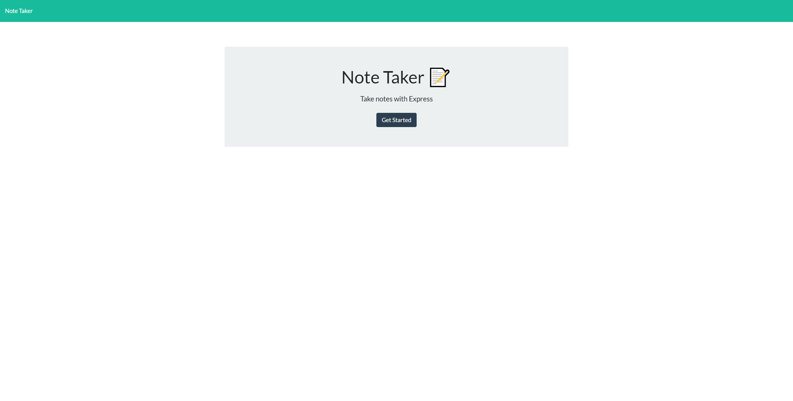
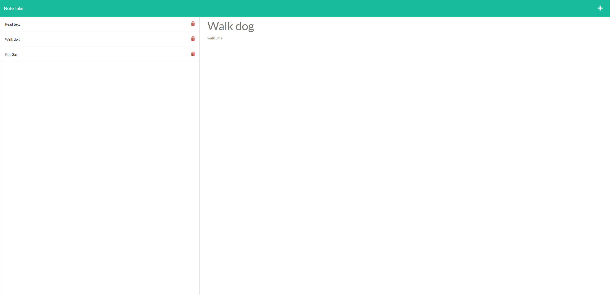

# Note Taker 

This assignment was to modify starter code to create an application called Note Taker that can be used to write and save notes. This application will use an Express.js back end and will save and retrieve note data from a JSON file.

## Table of Contents

- [Skills Practiced](#skills-practiced)
- [Installation](#installation)
- [Usage](#usage)
- [Screenshots](#screeenshots)
- [Deployed App](#link-to-deployed-app)
- [Questions](#questions)

## Skills Practiced

- Using node.js
- Using express.js
- Importing packages and creating a package.json
- Using fetch with routing using express.js
- Modularization of helper functions
- Reading and understanding someone elses code and then building on it
- Deploying to Heroku
- Using an API js file to route traffic based on route parameters
- Capturing data from url parameters to target specific items in an array
- Use the GET, POST, and DELETE methods with fetch and express.js
- Recording an apps functionality using a third party app

## Installation

If you want to download the app locally follow these steps.

1. Fork the repository
2. Clone the repo locally
3. In the terminal run "npm i" to download the dependencies.
4. Run "node server.js" to initiate the app.

## Usage

Allows a user to write, save and delete notes that persist in the app's db.json file.

## Screeenshots

 

## Link to Deployed App

[Deployed App](https://evening-escarpment-24555.herokuapp.com/)

## Questions

If you have any questions about this projects, please contact me directly at mep.summit@gmail.com. You can view more of my projects at https://github.com/peoplesm.
